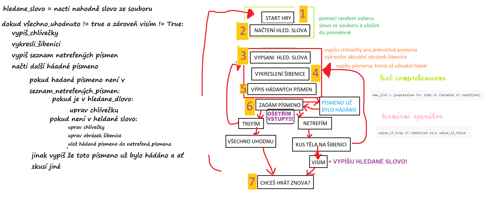

### 🪓 HANGMAN – Textová šibenice v Pythonu (verze 2.0) 🪓

---

#### 📝 Popis projektu

Tento projekt je vylepšená verze klasické textové hry **Hangman – Šibenice**, napsaná v jazyce Python.  
Hráč hádá písmena, aby odhalil hledané slovo, než se šibenice dokončí a kat vykoná svůj ortel.

Na této verzi jsem si chtěla **vyzkoušet uplatnění zásad ZOC – Zásady čistého kódu**. Zaměřila jsem se na čitelnější strukturu, logické rozdělení funkcí a srozumitelnější názvy proměnných.  
Z původního jednoduchého skriptu tak vznikla verze, kterou bych si sama ráda přečetla znovu i za měsíc. 😄

---

#### 💻 Funkce

1. **Náhodný výběr slova ze souboru**
2. **ASCII vykreslení šibenice podle počtu chyb**
3. **Přehledně zobrazené hrací pole**
4. **Zpracování vstupu hráče + kontrola opakování**
5. **Zobrazení neuhodnutých písmen**
6. **Vyhodnocení výhry nebo oběšení**
7. **Možnost zahrát si znovu**

---

#### 🛠️ Použité technologie

- **Python 3**
- **Rich knihovna** – barevný výpis v konzoli
- **Random** – náhodný výběr slov
- **Zásady ZOC (Zásady čistého kódu)** – přehlednost, modularita, čitelnost

---

#### 🧠 Návrh hry – pseudokód

Níže přikládám obrázek s mým původním návrhem logiky hry Hangman.  
Pomohl mi při plánování struktury kódu, rozdělení funkcí a pochopení průběhu hry.



---

#### 🚀 Jak projekt spustit

1. Ujisti se, že máš nainstalovaný Python 3.
2. Otevři terminál ve složce s projektem.
3. Spusť aplikaci příkazem:
   ```bash
   python hangman.py
   ```
4. Řiď se pokyny v konzoli a snaž se přežít. 😈

---

#### 📁 Struktura projektu

```
.
├── hangman.py                # Hlavní soubor s logikou hry
├── hangman_pictures.py       # ASCII obrázky šibenice
├── words.txt                 # Slova pro hru
├── assets/
│   └── Hangman_pseudokod.png # Můj původní návrh logiky hry
├── README.md                 # Dokumentace
└── .gitignore, LICENSE       # Git nastavení a licence
```

---

#### 💡 Možná vylepšení

- Přidání nápovědy ke slovu (kategorie, definice…)
- Herní mód pro dva hráče
- Uložení statistik výher a proher
- Grafické rozhraní (GUI)
- Překlad hry do angličtiny

---

#### 📜 Licence

Tento projekt je licencován pod licencí MIT – podrobnosti najdeš v souboru LICENSE.

---

#### 🤝 Inspirace & záměr

Tento projekt vznikl jako trénink strukturovaného a srozumitelného kódu.  
Díky práci s funkcemi, cykly a vstupy jsem si prohloubila porozumění Pythonu i základům čistého programování.

---

🪓 _Hangman – protože není nic lepšího než být chycen mezi slovo a smrt._ 💀

---
